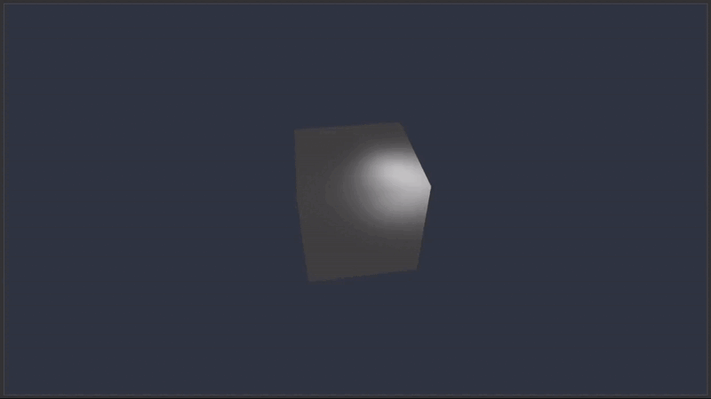
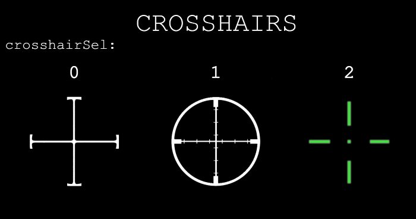
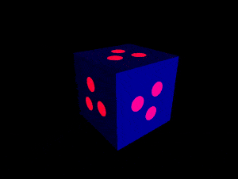
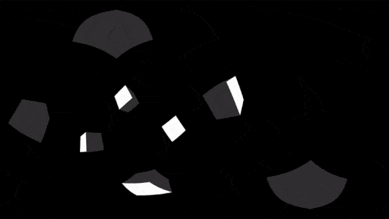
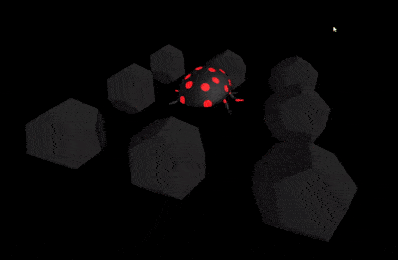
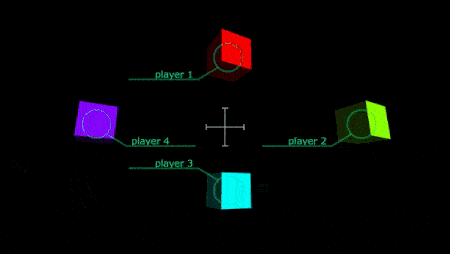

# Coordinates
<b>Coordinates</b> is a graphics API for JavaScript enabled web browsers. It has methods for leveraging the HTML5 canvas API to create <b>images</b>, <b>animations</b>, <b>games</b> or <b>artwork</b>. At this time, <b>WebGL</b> is the only supported context, but 2d canvas support is also planned. Note that Coordinates is under active development, and is in alpha stage, subject to architectural revisions that frequently break backward compatibility. It is recommended to fork the project or coordinates.js file at least, if you are building something so as to avoid function parameters changing, etc. <br>
<center>
  
 </center>
As a stand-alone module, <b>Coordinates</b> may be included in an HTML5 project, providing a framework for creating graphics <b>viewports, shaders</b>, stock and custom <b>shapes</b>, as well as <b>textures</b>, and a growing library of <b>effects</b>.


## Some example boilerplate
<b>Coordinates</b> uses functional design principles. There are no 'constructors'.<br>Most methods accept options via an object. E.g.
```js
var rendererOptions = {
  fov: 1500,  // field of vision
  ambientLight: .8,
  margin: 10,
  attachToBody: true  // if false, the canvas doesn't show up
}
```

Instantiation works with default settings as well. You can copy the code below  <br>
verbatim, into a file named ``index.html``, and see the result...<br>

```html
<!DOCTYPE html>
<html>
  <head>
    <title>Coordinates boilerplate example</title>
    <style>
      body, html{
        background: #333;
        margin: 0;
        min-height: 100vh;
        overflow: hidden;
      }
    </style>
  </head>
  <body>
    <script type="module">
    
      import * as Coordinates from
      "https://srmcgann.github.io/Coordinates/coordinates.min.js"
    
      // instantiate a canvas, 'renderer'. this is also our 'camera'
      var rendererOptions = {
        ambientLight: .5,
        fov: 1500
      }
      var renderer = await Coordinates.Renderer(rendererOptions)
      
      // back the camera away from the center (move it toward the viewer)
      renderer.z = 10
      
      // tell the API where to find our animation function
      Coordinates.AnimationLoop(renderer, 'Draw')

      // invoke a shader - phong in this case for a pseudo-lighting effect
      var shaderOptions = [
        { uniform: {
          type: 'phong',
          value: .75
        } }
      ]
      var shader = await Coordinates.BasicShader(renderer, shaderOptions)


      // create a scene (it's async, so we can 'await' each call, but that is optional)
      var shapes = []
        // load a cube
      var geoOptions = {
        shapeType: 'cube',
        size: 5,
        color: 0xffffff,
      }
      await Coordinates.LoadGeometry(renderer, geoOptions).then(async (geometry) => {
        shapes.push(geometry)
        await shader.ConnectGeometry(geometry)
      })  
      
      
      window.Draw = () => {
        shapes.forEach(shape => {
          shape.yaw += .01
          shape.pitch += .005
          renderer.Draw(shape)
        })
      }
      
    </script>
  </body>
</html>
```
the result<br>

<br><br>

## methods, options, and their defaults
#### Renderer()
``Coordinates.Renderer( rendererOptions )``
##### returns a camera object, creates a canvas, async
```js
var rendererOptions = {
  alpha: false,
  width: 1920,  // the interior viewport dimensions (pixels)
  height: 1080,
  clearColor: 0x333333,  // grey
  fov: 2e3,  // "field of vision", the camera's focal length
             // useful range:
             //   500 (perspective) to 100,000 (orthographic)
  ambientLight: .5,
  x:    0, y:     0, z:   0,
  roll: 0, pitch: 0, yaw: 0,
  margin: 10,  // the viewport will expand to fill as much of the
               // visible page as possible, resizing automatically,
               // with a margin of this amount
  attachToBody: true, // this can be set to false, for
                      // background/buffer operations if needed
  context: {
    mode: 'webgl',    // 2d is semi-implemented,
                      // not working at this time
    options: {
      alpha:         true,
      antialias:     true,
      desynchronize: true,
    }
  },
  plugins: [                    // optional plugins.
    {
      enabled: true
      type: 'post processing',      // plugin type.
      value: 'equirectangular',     // the subtype.
      params: [ 'omitSplitCheck' ], // optional performance
                                    // optimization. see notes
                                    // and example below.
    }
  ],
}
```
<br>

Additionally, a Renderer object contains a number of useful properties, auto-updated:
```js
renderer.pageX        // window mouse x coordinate
renderer.pageY        // window mouse y coordinate
renderer.mouseX       // internal canvas mouse x coordinate
renderer.mouseY       // internal canvas mouse y coordinate
renderer.mouseButton  // the browser window mouse button status
```
...and others. feel free to view a renderer object in your browser console:
``console.log(renderer)``
<br>
<br>


## DestroyRenderer()

``Coordinates.DestroyRenderer(renderer)``<br>
When a camera/renderer is instantiated it may begin an animation loop, as well as place a canvas on the screen. Pass a renderer object to this method to elminate the canvas and cancel the loop, e.g. for performance reasons.<br>
<br>

## LoadFPSControls()

``Coordinates.LoadFPSControls(renderer, options)``<br>
By default, a renderer/camera object 'orbits' the center point of the coordinate system. This may be useful in some cases but a mobile camera is also exposed via the ``LoadFPSControls`` method. 'FPS' stands for 'First Person Shooter', which loads a game style camera with appropriate mechanics, enabling the following:

  * basic keyboard controls:<br>
     W / A / S / D      -> move around<br>
     arrow keys / mouse -> look around<br>
     shift              -> run / speed boost<br>
  * optional crosshair, centered<br>
  * arbitrary camera movment<br>

Note: the optional properties below are also added to the renderer object, which is handy for toggling or resetting values on the fly.

Loading example [with default values]:

```js
var FPSOptions = {
  showCrosshair: true,  // whether or not to display a crosshair.
  crosshairSize: 1,     // crosshair graphic size multiplier
  crosshairSel:  0,     // Three premade crosshair graphics are available,
                        // or a custom graphic may be used.
  crosshairMap:  '',    // Optional URL to a custom crosshair graphic.
                        // If provided, the custom crosshair should be png
                        // if it involves transparency.
  mSpeed:        1.0,   // constant movement speed multiplier.
  rSpeed:        1.0,   // constant rotational speed multiplier.
  focusRequiredForMouse: true,  // if set to false, mouse-over is processed without clicking
  useKeys:       true,  // enabled by default, you may use the FPS camera only,
                        // without keys/mouse, by setting useKeys: false. This
                        // might be useful for environments where the default
                        // center-pointing camera isn't appropriate.
  flyMode:       false, // un-restrict camera movement.
                        // by default the camera is pinned to Y=0.
                        // with flyMode enabled, mousebuttons will control vertical
                        // movement, in addition to the usual keys
  grav:          .01,   // a gravity value, if needed
}
await Coordinates.LoadFPSControls(renderer, FPSOptions)

// optionally, the controls may be unloaded...
Coordinates.UnloadFPSControls(renderer)
```

<center>

 </center>

If a custom crosshairMap is used, it becomes a 4th element (3) in the crosshairSel array [0, 1, 2, 3]. If specified, crosshairSel is set to this automatically, but can be changed, or changed back.

Notes: The FPS camera config options are added to the renderer object when the FPS camera is loaded. For example, ``crosshairSel``, ``showCrosshair`` may be changed on the fly by setting ``renderer.crosshairSel = ...`` etc.

It's important also to be aware of the 'clipspace limitation' of every webgl application. The vertex shaders must reduce all geometry into unit space, including the Z dimension. This means all shapes and positions are divided so as to fit reasonably into the space of -1 to 1, for each dimension. This is a feature of *gl, so as to be able to efficiently 'clip' unused geometry. Shrinking geometry into unit space, while creating the illusion of a large area has the tradeoff of floating point errors on the small scale, such as z-fighting / artifacts. So to avoid such errors, a space of 10,000 units is generally made available by this API. With the default (center-oriented) camera, this is seldom a problem, but using the mobile/FPS camera it's very easy to 'leave' the clip space, which requires the programmer to anticipate and provide for some 'recentering' or 'space tiling' approach. Be aware, if the camera moves sufficiently far from the origin, the geometry may disappear due to leaving the apportioned space.

### Additional Properties Exposed by LoadFPSControls

As mentioned, the camera config options (``flymode``, ``showCrosshair``, etc.) are attached to the ``renderer`` object passed to ``LoadFPSControls``, but additionally, some other helpful properties are attached as well:<br>
``renderer.keys`` is an array of bools (true/false) with 256 elements corresponding to the ASCII keyCode of keyboard inputs. This array is updated by the API with a listener, and is created when ``LoadFPSControls`` is invoked. In your animation loop you may check key states, e.g.:

```js
renderer.keys.map((v, i) => {
  if(v) switch(i){
    case 32:
      console.log('spacebar down')
    break
  }
})
```

Another useful property is ``renderer.lastInteraction``, which shows the last ``renderer.t`` value at which user input was received by mouse or keyboard. This is good for detecting and acting on 'idleness', e.g., in your loop:

```js
if(renderer.t - renderer.lastInteraction > 60){
  console.log('user has been idle for 1 minute!')
}
```

Lastly, jumping, gravity, and other assumptions about the environment are not provided at this time. For game development approaches, the developer will need to bring in their own methods.
<br>
<br>

## Lighting

### Ambient Light

``ambientLight: [0 to ...]``<br>
Ambient light is available, optionally, as a parameter for shader instances, or globally as a Renderer parameter. If the renderer parameter is set, it will be overridden by a shader setting.<br>

### Point Lights

Point lights are invoked as a shapeType (``'point light'``), displayed optionally in scene with a default sprite, when the property is set ``showSource: true``. the ``color`` property describes the emmissive light color. ``lum`` sets the light power. ``size`` sets the sprite size, if used. ``map`` overrides the default sprite with a custom sprite texture, alpha supported. more below.
<br><br>

## Other Methods


### AnimationLoop()
``Coordinates.AnimationLoop( renderer, 'Draw' )``<br>
##### Returns nothing. Takes no options
The function named should be a<br>
window global  ``window.Draw = () => { ... }``, as to be callable
<br><br>

### BasicShader()
``Coordinates.BasicShader(renderer, shaderOptions)``<br>

##### Returns basic shader object, optional async
```js
var shaderOptions = {
  { lighting:
    { type:  'ambientLight',  // only ambientLight type is available at this time.
                              // if set, overrides renderer ambientLight. 
      value: [0 to 1]         // may be over/under clocked
    }
  },
  {
    uniform: { // phong shader
      enabled: true,      // may be toggled live, with other options
      type: 'phong',      // pseudo-lighting effect
      value: .3,          // intensity
      theta: .6,          // angle in radians about the horizontal
                          // (~4 oclock, default)
      flatShading: false,
    },
  },
  {
    uniform: { // reflection shader
      enabled: true,
      type: 'reflection', // reflect an image on shape surfaces.
                          // works best with 'equirectangular' maps
      map: 'https://example.com/image.jpg',
          // required. URL to an image or video (web formats accepted)
          // "power of 2" (64, 128, 256 etc.) width & height
          // makes it load directly, or it will be
          // resized in the background for drawing
          // performance, with a load-time hit
          // "po2" is required by *gl for texture wrapping
      value: .5,  // intensity. range: 0 = invisible, to 1 = total, may be over/under clocked
      flatShading: false,
    }
  }
}
```
<br><br>

### LoadGeometry()
``Coordinates.LoadGeometry( renderer, geoOptions )``<br>

##### Returns a mesh object, optional async
<br>

### DestroyGeometry()
``Coordinates.DestroyGeometry( geometry)``<br>
Destroy any references to shapes created with ``LoadGeometry``.
Currently applies to lights only, which are the only system-side data
stored when geometry is created.

<br>

#### a note about lighting
An object returned by ``LoadGeometry`` is not kept in system memory. You are expected to create a data structure for managing shapes, without which they have no permanency. A geometry, especially if 'connected' to a shader, is a whole, drawable entity and no special GC (garbage collection) work is required, since they are not stored. The only exception is lights, which are queued internally so that the scene is influenced by them. To remove a light, use the ``DestroyGeometry(shape)`` method, which removes the light source, but not your own reference to it, if any. Recall a light may be visible in your scene with the `showSource: true` property setting, and the shape returned by LoadGeometry (a rectangle) is not stored system-side, and will remain visible after the light is destroyed. You may use, for example if your shapes are in an array named 'shapes' and your light is named 'my light': ``shapes = shapes.filter(v=>v.name != 'my light')`` to remove the shape from your array.
<br>

```js
var geoOptions = {
  name: 'background',  // optional name for object
  x: 0, y: 0, z: 0,    // initial coordinates
  roll: 0,             // orientation / rotation
  pitch: 0,
  yaw: 0,
  rotationMode: 0,     // options are 0, 1, or 2, representing the order of axes a shape is rotated about.
                       // this is useful for situations when the default results in incorrect rotations,
                       // e.g. when the FPS camera is used.
                       // 0 is yaw, then pitch, then roll  (normal rotation)
                       // 1 is pitch, then yaw, then roll  (shapes that rotate in an FPS env)
                       // 2 is roll, then pitch, then yaw  (needed rarely if ever)
  scaleX: 1,           // resize (at creation)
  scaleY: 1,
  scaleZ: 1,
  scaleUVX: 1,         // resize uvs (at creation), useful for tiling,
                       // or un-tiling textures.
  scaleUVY: 1,         // e.g. scaleUVX:3, scaleUVY:3, -> tiles map x 3.
                         // some maps may not tile well!
  offsetUVX: 1,        // 'slide' texture right/left. one unit +/- is the 
                       // texture width, wrapped.
  offsetUVY: 1,        // 'slide' texture up/down. one unit +/- is the
                       // texture height, wrapped.
                       // note: offsetting uvs is performed before scaling.
  map: '',             // optional texture, URL to an image, or video.
                         // for videos, use ``muted: false`` to prompt
                         // the user to play audio, if desired.
  equirectangular: false,  // if enabled, textures are assumed to be spherical.
                           // for example, setting equirectangular: true for a
                           // cube wraps the texture around it, versus repeating it
                           // per face.
  heightMap: '',       // a geometry modifier texture [image/canvas/video].
  heightMapIsCanvas: false,  // if a canvas is used for the heightMap, this must be
                             // set to true.
  heightMapIntensity: 1,   // if a heightMap is used, this defines the distance from
                           // zero (in the direction of normals) that the geometry
                           // is deformed.
  equirectangularHeightmap: false, // same as 'equirectangular' for a map, but
                                   // for only the heightMap.
  color: 0x333333,     // optional color
  colorMix: .5,        // weight of the color, to mix with texture
  playbackSpeed: 1.0,  // if the texture (map) is a video, adjust the speed (.1 to 10)
  canvasTexture: can,  // shapes accept canvases as textures, which are read
                       // dynamically at draw time, allowing for animated textures.
                       // see the example below, for useage.
  canvasTextureMix: 1, // If a canvas is provided as a texture, this is the amount 'mixed' with the
                       // ordinary texture ('map'), if one is also provided.
                       // note: reflections, color, textures, and canvasTextures may all be used together.
  wireframe: false,    // if true, display shape as lines
  exportShape: false,  // exports any shape to its fast-loading, internal format,
                       // the exported data can be saved into files and re-loaded
                       // with as 'custom shape' type. 'exported' shapes are
                       // displayed on-screen with copy-to-clipboard buttons.
  downloadShape: false,// same as 'exportShape', but file(s) are downloaded instead
                       // of displayed on screen.
  sphereize: 1,        // interpolate a polyhedron to a sphere (=1), and beyond
                         // read more below about this feature
  averageNormals: false, // generate/recompute normals for any shape @ load
  size: 1,             // not required, but the default may not be appropriate.
  subs: 0,             // subdivides a polyhedron above, creating exponentially
                       // more polygons/faces. Advise no more than 4!
  shapeType: ''    // required.
                   // supported types:
                       • 'tetrahedron'
                       • 'cube'
                       • 'octahedron'
                       • 'dodecahedron'
                       • 'icosahedron'
                       • 'rectangle'
                         // is a squre, unless scaled
                       • 'sprite'
                         map: [url] (required)
                         alpha: 0-1 // supports alpha channel (png source)
                         size: 1.0 (squre, always camera-facing)
                         subs: 0 - 5 (poly subdivisions, for finer resolution)
                      // LIGHTS
                         //- other objects require phong shader for
                         //  lights to affect them, except for
                         //  ambient light
                       • 'point light'
                         // is both a 'sprite' (optionally) and a light source.
                         // may have up to 16 in a scene.
                         // has optional parameters, in addition to sprite params:
                              lum : 0.0 to ...
                              color: 0xffffff e.g.
                              showSource: true/false
                              // ignores shader, if one is connected
                       • 'cylinder'
                       • 'torus'
                       • 'torus knot'
                         // cylinder, torus [knot] accept 'rows' and 'cols', optionally. if omitted, high-res
                         // shapes are quick-loaded. recommend zero subs,
                         // omit rows/cols unless custom shape is needed.
                         // Or export a custom shape & load it as such.
                       • 'obj'
                       • 'custom shape',
                         // "custom shapes" may be obtained from any
                         // shape, by enabling the 'exportShape' option.
                         // These files may then be loaded via the
                         // shapeType 'custom shape', and 'url', which
                         // is streamlined for the fastest load times
                       • 'dynamic',
                         // The 'dynamic' shape type is used when geometry is
                         // expected to change during render, as in animations
                         // with deformable shapes. Note: every Coordinates
                         // shape, dynamic or not, has these exposed buffers:
                         // `shape.vertices`,
                         // `shape.uvs`,
                         // `shape.normalVecs`, and
                         // `shape.normals`.
                         //  These can be modified, for any shape, but 'dynamic' shapes
                         //  bypass any pre-built methods, creating empty buffers
                         //  and allow the inclusion of geometric data via the
                         //  LoadGeometry option: 'geometryData', and
                         //  'texCoords' (optionally). These properties expect
                         //  data in the following structure:
                         //  geometryData: [  // object/shape
                         //    [              // face/polygon
                                 [X,Y,Z], [X,Y,Z], [X,Y,Z], ... // vertices
                         //    ], ...
                         //  ],
                         //  texCoorods: [    // object/shape
                         //    [              // face/polygon
                                 [U, V], [U, V], [U, V], ... // UVs per vertex
                         //    ], ...
                         //  ],
                         // Considerations: triangles may be used of course, but quads
                         // 5-gons, and even 6-gons are accepted. Higher-point geometry
                         // (>6) may result in undefined behavior, and 3-6 are all
                         // converted to 3-gons, except quads. Like any shape
                         // returned by the LoadGeometry method, buffers are
                         // not references to the original data, but new, contiguous,
                         // buffer-style, packed Float32 arrays. When reading/modifying
                         // these buffers, vertices appear in 3's (X,Y,Z), without
                         // labels or separation. E.g. shp.vertices = [X,Y,Z,X,Y,Z...]
                         // There are 2 shape buffers for normals: 'normals', and
                         // 'normalVecs'. The former are 6-element-stride arrays,
                         // e.g. [X1,Y1,Z1,X2,Y2,Z2, X1,Y1,Z1,X2,Y2,Z2, ...],
                         // with an assumed start and end point for drawing normal
                         // lines in their spatial positions. 'normalVecs' are proper
                         // vectors, for use in the shader. Note that 'normals' are not
                         // automatically re-computed, unless requested. For this
                         // purpose there is the exposed method 'Normal(facet)', and
                         // SyncNormals(shape, averageNormals=false), which
                         // will recalculate all normals & normalVecs, optionally
                         // averaging them with a significant performance cost.
                         // Example:
                         //   shape.vertices[212] -= .2         (why not?)
                         //   Coordinates.SyncNormals(shape, true) 
                         //      //(reflections fixed!)
                         // 
                         // Lastly, SyncNormals() can and will generate
                         // new normals for the supplied shape. All shape types offer
                         // access to this method, if the property is set:
                         // `preComputeNormalAssocs: true`, but for 'dynamic' shapes
                         // it is automatically available.
                       • 'particles',
                         // The 'particles' shape type is just like 'dynamic'
                         // (above), except vertices are drawin as points. The
                         // number of particles drawn is the number supplied in the
                         // geometryData array passed to LoadGeometry.
                         // Relevant particle properties:
                         size: [0 to 1...],  // max size limited by your GPU.
                                             // check max point size.
                                             // particle sizes are influenced by
                                             // perspective / renderer.fov
                         scaleX|Y|Z: particle field is scaled @ creation.
                         color: [standard / hex, e.g. 0xff0000 (red) ],
                                // recall functions, e.g. HexFromHSV(0, 1, 1) (red)
                         alpha:    [0 to 1],
                         penumbra: [0 to 1, optional 'halo' alpha value],
                         // considerations: each collection of particles is
                         // contained as a single shape buffer. To manipulate
                         // individual particles, either create multiple shapes
                         // or access / modify the data via geometry.vertices etc.
                         
  exportShape: false, // display popup for each geometry which has this option
  objX: 0,            // for 'obj' or 'custom shape' format models, initial offset
  objY: 0,
  objZ: 0,
  objRoll: 0,         // for 'obj' or 'custom shape' format models, orient/rotate
  objPitch: 0,
  objYaw: 0,
                      // enabled, to copy its raw data for later import as a
                      // 'custom shape'.
  flipNormals: false,    // invert normals
  url: '',               // url for 'OBJ' format, or 'custom shapes'.
                         // url is ignored otherwise.
  showBounding: false,       // use an overlaying canvas to show the bounding perimeter
                             // of a shape or particle cluster. This property may be set
                             // at any time, or called manually with the 
                             // Coordinates.ShowBounding() method - example below
  boundingColor: 0x88ff22    // change/set the bounding color
}
```
<br><br>

### geometry.sphereize = [value]
This value, when set as an option for LoadGeometry, interpolates a polyhedron
between its normal shape (e.g. a cube), and sphere. A value of 0 (zero) is the
shape's original, expected appearance, and 1 is a sphere. Values less than zero
or more than 1 are accepted. NOTE! if sphereize is used, you should set
``averageNormals: true``, to recompute the data used by reflections, lighting etc.
<br><br>

### ConnectGeometry()
Performs linkage between geometry created with the ``LoadGeometry`` method, and a shader created with the ``BasicShader`` method. If not called, <b>Coordinates</b> will use a null shader (no effects) so the shape can be drawn. Connecting geometry to a shader removes it from any previous connections.

``shader.ConnectGeometry( geometry )``

##### Returns nothing, optional async
<br><br>

### Clear()
Clears the viewport.<br>
Note: WebGL "swaps" buffers by default, resulting<br>
in the clearing of drawn elements, but not the background. This clears<br>
the background as well. See Renderer option 'clearColor', to set the color.<br>

``renderer.Clear()``

##### Returns nothing
<br><br>

### Draw()
Draws a single geometry created with the ``LoadGeometry`` method<br>

``renderer.Draw(geometry)``

##### Returns nothing
<br><br>
These color helper methods are also exposed
```js
  HSVToHex
  HexFromHSV
  HSVToRGB
  RGBFromHSV
  HexFromRGB
  RGBToHex
  RGBFromHex
  HexToRGB
```
example:<br>
```js
var geoOptions = {
  shapeType: 'cube',
  //...
  color: Coordinates.HexFromHSV(180, 1, 1),  //teal
  //...
}
```

<br><br>

## Animations

### LoadAnimationFromZip()
Animations may be loaded via zip-format archives, with some options shown below:<br>
``LoadAnimationFromZip(renderer, options, shader)``
<br>

``LoadAnimationFromZip(renderer, options, shader)``

``options`` is passed in the exact same way as a geoOptions object gets passed to the LoadGeometry method (see above). properties are applied to the contents of the zip file as if they were loaded individually.<br>

Notes:<br>
1) a ``url`` is required, pointing to a zip file.
2) ``shapeType`` is required, same as calls to ``LoadGeometry``
3) zip-file contents must exist in the archive root as files, with a single format
4) ``downloadShape`` will download the shape(s), converted to the ``custom shape`` format - for all files in the zip file. Alternatively, ``exportShape`` will display the same info on screen with an option to copy it.
5) the ``name`` provided in options, will be prepended to downloaded file-names.
6) the object returned by this method is just an array of shapes/geometries, which may be passed into the ``DrawAnimation`` method

<br>

### DrawAnimation()
A companion method may be used to render the array returned by ``LoadAnimationFromZip`` :
<br>

``DrawAnimation(renderer, options, shader)``

``options`` isn't required, but may include these properties which are applied to all frames
```js
var animationOptions = {
  x: 0, y: 0, z: 0,
  roll: 0, pitch: 0, yaw: 0,
  loopMode: 'reverse',
  animationSpeed: 1,
}
```

Notes:<br>
``loopMode`` may be 'reverse', 'cycle', or omitted. the former runs the animation forward and then backward, looping while the latter loops from the first frame. ``reverse`` is the default.<br>
``animationSpeed`` is self explanatory, with an expected range of 0.0 to 1.0, from stopped to advancing +1 frame per call, with fractional values reflecting frequencies in between.
<br><br>

#### Animation Usage Example:
```js
var X = 1
var Y = 0
var Z = 0
var ar = Coordinates.R(X, Y, Z, {0, 0, Math.PI})
// ar -> [-1, 0, 0]

```

<br><br>

## Tips and tricks

### textures

Videos and images are interchangeable as texture sources. A video may be referenced numerous times as a shape texture and / or as a reflection map, without concern for performance degradation as a result of the multiple references, however video frame calls themselves at render time do impact performance.<br><br>
Coordinates involves an internal cache for all network resource calls with the URL as a key. There may be occasions to bypass the cache (e.g. displaying the same video at a different speed on two objects), in which case you may inoke the ``involveCache: false`` property which forces a new instance of that resource, available on all configurations where network resources apply. If the involveCache property is used and set to false, the order in which calls occur is relevant to the resulting settings for each instance. Some experimentation may be called for to achieve your desired results.<br><br>

If your texture appears faded or you can't get the lighting / colors crisp with the desired contrast, this may be due to the shape's colorMix, which has a nonzero default value. Try setting ``colorMix: 0`` for your geometry, which removes the shape's color from the mix.


#### canvasTexture
Geometry loaded with the LoadGeometry method accepts a texture 'map', but a canvas may also be passed, in addition or by itself. The canvas reference is read at the time the shape is drawn, allowing for dynamic textures. Canvases passed may be 2d, webgl, or even a reference to Coordinates renderer screen via the ``renderer.c`` property.

Example:
```js
var rendererOptions = {
  ambientLight: .5,
  fov: 1500,
}
var renderer = await Coordinates.Renderer(rendererOptions)

renderer.z = 10

Coordinates.AnimationLoop(renderer, 'Draw')

var shaderOptions = [
  { uniform: {
    type: 'phong',
    value: .75,
  } }
]
var shader = await Coordinates.BasicShader(renderer, shaderOptions)


var shapes = []

var myCanvas = document.createElement('canvas')
myCanvas.width = 512
myCanvas.height = 512
var ctx = myCanvas.getContext('2d')
const updateMyCanvas = () => {
  ctx.fillStyle = '#000'
  ctx.fillRect(0, 0, myCanvas.width, myCanvas.height)
  for(var i = 0; i<3; i++){
    var p = Math.PI * 2 / 3 * i + renderer.t * 8
    var X = myCanvas.width/2  + Math.sin(p) * 100
    var Y = myCanvas.height/2  + Math.cos(p) * 100
    ctx.beginPath()
    ctx.arc(X, Y, 50,0,7)
    ctx.fillStyle = '#f00'
    ctx.fill()
  }
}

var geoOptions = {
  shapeType: 'cube',
  size: 5,
  subs: 3,
  canvasTexture: myCanvas,
  canvasTextureMix: 1,
  color: 0x0000ff
}
await Coordinates.LoadGeometry(renderer, geoOptions).then(async (geometry) => {
  shapes.push(geometry)
  await shader.ConnectGeometry(geometry)
})  


window.Draw = () => {
  updateMyCanvas()
  shapes.forEach(shape => {
    shape.yaw += .01
    shape.pitch += .005
    renderer.Draw(shape)
  })
}
```

This creates such output<br>
<center>

 </center>


## Plugins

### Post Processing
Camera/renderer objects returned by the ``Renderer()`` method, may include a plugin stack, optionally. The library of available plugins is growing but here is one example:<br>

```js
var rendererOptions = {
  ambientLight: .1,
  fov: 1500,
  margin: 0,
  plugins: [
    {
      type: 'post processing',
      value: 'equirectangular',
      enabled: true,
    }
  ],
}
var renderer = await Coordinates.Renderer(rendererOptions)

Coordinates.AnimationLoop(renderer, 'Draw')

var shaderOptions = [
  { uniform: {
    type: 'phong',
    value: .75
  } }
]
var shader = await Coordinates.BasicShader(renderer, shaderOptions)

var shapes = []

var cl = 2, rw = 2, br = 2, sp = 8
for(var i = 0; i<cl*rw*br; i++) {
  var x = ((i%cl) -cl/2) * sp
  var y = (((i/cl|0)%rw) - rw/2 + .5) * sp
  var z = ((i/cl/rw|0)-br/2 + .5) * sp
  var geoOptions = {
    shapeType: 'cube',
    x, y, z,
    size: 2,
    subs: 2,
    colorMix: .6
  }
  await Coordinates.LoadGeometry(renderer, geoOptions).then(async (geometry) => {
    shapes.push(geometry)
    await shader.ConnectGeometry(geometry)
  })  
}

renderer.z = 0

window.Draw = () => {
  var t = renderer.t
  renderer.yaw   = t
  renderer.pitch = t
  shapes.forEach(shape => {
    shape.yaw   += .01
    shape.pitch += .05
    renderer.Draw(shape)
  })
}
```
This creates such output<br>
<center>

 </center>


## Additional Helper Methods

### R()
Coordinates performs geometric rotations in shader for performance reasons, but there may be times when scene geometry should be modified manually, apart from shape positions and rotations, such as deforming geometry or custom rotations. The ``R`` function is exposed for this, and expects paramters as follows<br>
``R = (X, Y, Z, {roll, pitch, yaw}, addCameraZ = false)``
<br><br>
``R`` returns a 3-component ( [X, Y, Z] ) array with the resulting, modified input vertex
<br><br>example:
```js
var X = 1
var Y = 0
var Z = 0
var ar = Coordinates.R(X, Y, Z, {0, 0, Math.PI})
// ar -> [-1, 0, 0]

```
<br><br>
### Normal()
A geometric 'normal' is vector, perpendicular to a plane or polgon. Normals are used for many purposes, including shading, reflections, and collision detection.<br>
A method, ``Normal``, is exposed for manually computing the normal of any set of points, which are assumed to constitute a plane or flat surface of arbitrary orientation in space, usually a triangle or quad.<br>
``Normal = (facet, autoFlipNormals=false, X1=0, Y1=0, Z1=0) ``
<br>
``Normal`` requires input of a 2D array of at least 3 vertices. Additionally, it may ``autoflip`` away from the origin, which may be supplied as X1, Y1, Z1, shown above, or assumed to be 0,0,0 if these are omitted.
<br><br>
example:
```js
var facet = [
  [-1, 0, 0],
  [0,  0, 1],
  [1,  0, 0],
]
var n = Coordinates.Normal(facet)
// n -> [0,0,.33,  0,-1,.33]
// returned vector is centered in the polygon, and has 6
// elements, a vec3 start and end point.
// This is for purposes of drawing vector lines, but the raw
// vector [X, Y, Z] may be obtained by subtracting the last 3 elements
// from the first 3, respectively. Note that meshes in Coordinates are
// configured to use 1 normal per vertex, but each vertex in a polygon
// has the same normal, until 'averaged'. See averageNormals above for
// creating smooth surfaces, etc.

```
<br><br>
### Reflect()
Computes the angle of reflection in 3D space, accepting parameters of incident-angle, and normal<br>
``Reflect = (i, n)``
<br>
``Reflect`` requires input of a source angle, and the facet/plane normal upon which the angle of reflection is occuring.
<br><br>
example:
```js
var iAngle = [.2, 0, .5]
var n = Normal(facet)  // see above for notes about the Normal method
var rAngle = Coordinates.Reflect(iAngle, n)
// returned angle is useful for motion vectors or light, e.g. for ray tracing
```

<br><br>

### ShowBounding()
``const ShowBounding = (shape, renderer, draw=true)``
<br><br>
``ShowBounding`` returns a bounding polygon if the shape is in cam/render view, or false.<br>
If the ``draw`` param is present, it will determine whether the bounding shape is visible.<br>
This is useful for testing whether a point is inside or outside the bounding polygon, as in<br>
'picking' in combination with the mouseX/mouseY renderer properties.<br><br>
A geometry/shape may also include a ``showBounding``, and/or a ``boundingColor`` property in<br>
its config options.

code example:
```js
var bug, dodec, geoOptions

geoOptions = {
  shapeType: 'dodecahedron',
  size: 3.3,
  sphereize: .01,
  boundingColor: 0xff0000,
}
await Coordinates.LoadGeometry(renderer, geoOptions).then(async (geometry) => {
  dodec = geometry
  await shader.ConnectGeometry(geometry)
})  

geoOptions = {
  shapeType: 'custom shape',
  url: 'https://srmcgann.github.io/Coordinates/custom shapes/ladybug.json',
  map: 'https://srmcgann.github.io/Coordinates/custom shapes/LADYBUG.png',
  size: .4,
  y: -4,
  flipNormals: true,
  equirectangular: true,
}
await Coordinates.LoadGeometry(renderer, geoOptions).then(async (geometry) => {
  bug = geometry
  await shader.ConnectGeometry(geometry)
})


renderer.z = 14
renderer.pitch = .5

window.Draw = () => {
  var t = renderer.t
  renderer.yaw += .005
  
  var cl = 3  // columns
  var rw = 1  // rows
  var br = 3  // 'bars?'
  var sp = 8  // spacing
  
  for(var i=0; i<cl*rw*br; i++){
  
    var shape = i == 4 ? bug : dodec
    
    shape.x = ((i%cl)-cl/2 + .5) * sp
    shape.y = (((i/cl|0)%rw)-rw/2 + .5) * sp
    shape.z = ((i/cl/rw|0)-br/2 + .5) * sp
    renderer.Draw(shape)
    
    // check if mouse cursor is inside a bounding poly. draw if so.
    // note: this does no automatic depth checking. that is up to you.
    
    var poly = Coordinates.ShowBounding(shape, renderer, false)
    if(Coordinates.PointInPoly2D(renderer.mouseX, renderer.mouseY, poly)){
      Coordinates.ShowBounding(shape, renderer, true)
    }
  }
}
```

The code above produces this result:
<center>

 </center>


<br><br>
### Intersects()
``const Intersects = (X1, Y1, X2, Y2, X3, Y3, X4, Y4)``
<br><br>
``Intersects`` returns a 2D vertex of the intersection point if one exists, between 2 line segments, or false if there is no intersection.<br>
<br><br>
Method requires input of 8 numbers, the endpoints of the line segments in the order Pa1, Pa2, Pb1, Pb2.
<br><br>
example:
```js
var X1 = -.5
var Y1 = -1
var X2 = 1.5
var Y2 = 1
var X3 = 1.5
var Y3 = -1
var X4 = -.5
var Y4 = 1
var i = Coordinates.Intersects(X1, Y1, X2, Y2, X3, Y3, X4, Y4)
// returned value: [ 0.5, 0]
```

<br><br>
### PointInPoly2D()
``const PointInPoly2D = (X, Y, polygon)``
<br><br>
``PointInPoly2D`` returns true if the point is inside a polygon of any number of sides.<br>
<br><br>
Method requires input of 2 numbers, which is the point in question, and a polygon as an array with at least 3 vertices
<br><br>
example:
```js
var polygon = [ [-1.2, 0, 0],   [0, -1, 0],   [3, 1, 2] ]
var X = 0,  Y = 0
var point = Coordinates.PointInPoly2D(X,Y, polygon)
// returned value: true
// note: a 3D polygon may be used, but only the first 2 elements [X, Y] are involved
```

<br><br>
### PointInPoly3D()
``const PointInPoly3D = (X1, Y1, Z1, X2, Y2, Z2, polygon)``
<br><br>
``PointInPoly3D`` returns the intersection point, if any (or false), of a line segment and polygon in 3 dimensions.<br>
For convenience, the normal of the polygon is also returned as a second element.
<br><br>
Method requires input of 6 numbers, which are the 2 end points of a line-segment in 3D space (2x3=6) and a polygon as an array with at least 3 vertices
<br><br>
example:
```js
var polygon = [ [-1.2, 0, 0],   [0, -1, 0],   [3, 1, 2] ]
var X1 = .5,  Y1 = -.5,  Z1 = 3
var X2 = .2,  Y2 = .2,   Z2 = -1
var point = Coordinates.PointInPoly3D(X1,Y1,Z1,  X2,Y2,Z2,  polygon)
// returned value: point, normal ->
  [
      [
          0.3148953466981546,
          -0.067901234567901,
          0.530894024154322
      ],
      [
          0.3205339025930031,
          0.38464068311160365,
          -0.8654415370011083
      ]
  ]
// note: returns false if no intersection exists
```

<br><br>
### IsPowerOf2()
``const IsPowerOf2 = (num)``
<br><br>
``IsPowerOf2`` returns a true if the input number is a valid power of 2, or false if not.<br>
<br><br>
Method requires input of 1 number.
<br><br>
example:
```js
var po2 = Coordinates.IsPowerOf2(3)
// returned value: false

var po2 = Coordinates.IsPowerOf2(4)
// returned value: true
```

<br><br>
### GetShaderCoord()
``const GetShaderCoord = (vx, vy, vz, geometry, renderer)``
<br><br>
``GetShaderCoord`` returns the rasterized [x, y(, z)] canvas coordinate of a provided vertex ``(vx, vy, vz, ...``, relative to a given shape-geometry and renderer, using their current settings. These may include things like a heightmap and/or equirectangular plugin. The returned point represents where on the 2D canvas, the 3D point will be drawn. The provided shape-geometry has a position, orientation, and possible displacement modifier(s), which are factored into the output. This method may be useful for plotting overlay graphics, or interactivity which depends on click location for example.<br>
<br>
Method requires input of 3 numbers, x/y/z of a vertex, a shape-geometry object, and a renderer object.
<br><br>
example:
```js
var vx = geometry.vertices[0]
var vy = geometry.vertices[1]
var vz = geometry.vertices[2]
var px = GetShaderCoord (vx, vy, vz, geometry, renderer)
// px = returned value [X, Y(, Z)], where the actual first vertex
// in the shape geometry will be drawn on canvas. the z/depth
// component is also returned.
```

<br><br>
### Overlay
``Coordinates.Overlay`` is a transparent 2d canvas created atop every renderer viewport by default, with matching width/height. It is used for displaying bounding outlines if they are configured, but it is exposed for other purposes as well. The Overlay is an ordinary ``Renderer`` object like any camera/renderer, but with a '2d' canvas type, full transparency and is auto-cleared between frames. Its context is ``Overlay.ctx``, and the element itself is ``Overlay.c``. With these, any 2d canvas operations may be performed.<br><br>

a complete working example:
```js
<!DOCTYPE html>
<html>
  <head>
    <title>Coordinates boilerplate example</title>
    <style>
      body, html{
        background: #333;
        margin: 0;
        min-height: 100vh;
        overflow: hidden;
      }
    </style>
  </head>
  <body>
    <script type="module">

      import * as Coordinates from
      "https://srmcgann.github.io/Coordinates/coordinates.min.js"

      var rendererOptions = {
        ambientLight: .5,
        fov: 2e3,
        z: 85
      }
      var renderer = await Coordinates.Renderer(rendererOptions)

      Coordinates.AnimationLoop(renderer, 'Draw')

      var shaderOptions = [
        { uniform: {
          type: 'phong',
          value: .75
        } }
      ]
      var shader = await Coordinates.BasicShader(renderer, shaderOptions)

      var shapes = []
      
      var playerNum = 4, p
      for(var i=0; i<playerNum; i++){
        var x = Math.sin(p = Math.PI*2/playerNum*i) * 48
        var y = Math.cos(p) * 24
        var z = 0
        var geoOptions = {
          name: 'player ' + (i+1),
          shapeType: 'cube',
          size: 10,
          x, y, z,
          color: Coordinates.HSVToHex(360/playerNum*i,1,1),
        }
        await Coordinates.LoadGeometry(renderer, geoOptions).then(async (geometry) => {
          shapes.push(geometry)
          await shader.ConnectGeometry(geometry)
        })
      }
      
      Coordinates.LoadFPSControls(renderer)
      
      var ctx = Coordinates.Overlay.ctx
      
      const strokeCustom = () => {
        ctx.globalAlpha = .2
        ctx.lineWidth = 10
        ctx.stroke()
        ctx.globalAlpha = .5
        ctx.lineWidth = 2
        ctx.stroke()
      }

      const drawPlayerNames = shape => {
        var pt = Coordinates.GetShaderCoord(0,0,0, shape, renderer)
        var rad = 60
        ctx.fillStyle = ctx.strokeStyle = '#0f8'
        ctx.beginPath()
        ctx.arc(pt[0], pt[1],rad,0,7)
        strokeCustom()
        
        var lx, ly
        ctx.beginPath()
        if(pt[0] > Coordinates.Overlay.c.width/2){
          lx = -1
          ctx.textAlign = 'right'
        }else{
          lx = 1
          ctx.textAlign = 'left'
        }
        if(pt[1] > Coordinates.Overlay.c.height/2){
          ly = -1
        }else{
          ly = 1
        }
        var d = Math.hypot(lx, ly)
        ctx.lineTo(pt[0]+lx/d*rad, pt[1]+ly/d*rad)
        ctx.lineTo(pt[0]+lx/d*rad*3, pt[1]+ly/d*rad*2.2)
        ctx.lineTo(pt[0]+lx/d*rad*10, pt[1]+ly/d*rad*2.2)
        strokeCustom()
        
        ctx.globalAlpha = .8
        var fontsize = rad / 1.5
        ctx.font = fontsize+'px verdana'
        lx = pt[0]+lx/d*rad*3.5
        ly = pt[1]+ly/d*rad*2.2
        ctx.lineWidth = 5
        ctx.strokeStyle = '#000d'
        ctx.strokeText(shape.name, lx, ly-fontsize/6)
        ctx.fillText(shape.name, lx, ly-fontsize/6)
      }

      window.Draw = () => {
        shapes.forEach(shape => {
          shape.yaw += .01
          shape.pitch += .005
          renderer.Draw(shape)
          drawPlayerNames(shape)
        })
      }
      
    </script>
  </body>
</html>
```
The code above produces this result:
<center>

 </center>

<br><br>
### GenHash()
``Coordinates.GenHash`` accepts string data as a parameter, returning a custom, unique 32 character hash. Hashes are useful for many things, including fingerprinting of unique items which may be of arbitrary size/length.
<br>

example:
```js
var ar = ['apples', 'bananas', 'peaches']
ar = ar.map(v=>({name: v, hash: Coordinates.GenHash(v)}))

/* ar ->
[
    {
        "name": "apples",
        "hash": "uvxzDFJLPVX379djprxBDJNT157bdhvz"
    },
    {
        "name": "bananas",
        "hash": "LMOQUW026cekoquAGIOSU04aimosuyMQ"
    },
    {
        "name": "peaches",
        "hash": "NOQSWY248egmqswCIKQUW26ckoquwAOS"
    }
] */

// then, to select an item by its unique hash:
var match = ar.filter(v=>v.hash=='NOQSWY248egmqswCIKQUW26ckoquwAOS')
if(match.length) console.log(match[0].name)

// > 'peaches'
```
