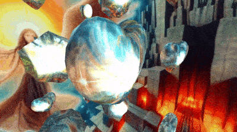

# Coordinates
<b>Coordinates</b> is a graphics API for JavaScript enabled web browsers. It has methods for leveraging the HTML5 canvas API to create <b>images</b>, <b>animations</b>, <b>games</b> or <b>artwork</b>. This API uses <b>WebGL2</b>. Browsers which do not support webgl2 may have issues (black viewports), although 2d contexts may be invoked using this API which have much broader support.<br><br>
<center>
  
 </center>
As a stand-alone module, <b>Coordinates</b> may be included in an HTML5 project, providing a framework for creating graphics <b>viewports, shaders</b>, stock and custom <b>shapes</b>, as well as <b>textures</b>, and a growing library of <b>effects</b>.


### the ``coordinates.js`` docs have moved to a more dynamic platform, with live examples.
Check back for updated links. The documentation is under active development at this time.

## Documentation
### general documentation, introduction
- [Main overview (section 1)](https://whr.rf.gd/coordocs/?s=IRjVAGs0Y&p=1)
- [Main overview (section 2)](https://whr.rf.gd/coordocs/?s=pCthTgx6f&p=1)
- [Main overview (section 3)](https://whr.rf.gd/coordocs/?s=9NiTZsLqN&p=1)
- [Main overview (section 4)](https://whr.rf.gd/coordocs/?s=huntg2zQY&p=1)
- [Main overview (section 5)](https://whr.rf.gd/coordocs/?s=F8FIWp6fl&p=1)
- [Main overview (section 6)](https://whr.rf.gd/coordocs/?s=F1YNUKnAD&p=1)

## other sections
[ShapeFromArray](https://whr.rf.gd/coordocs/?s=fqAGEVGSC&p=1) speed / grouping

[raw shapes](https://whr.rf.gd/coordocs/?s=gsPYtHhNC&p=1) manual and procedural shapes

[ShapeToLines](https://whr.rf.gd/coordocs/?s=iSyJ2lMJN&p=1) wireframe style

[fog](https://whr.rf.gd/coordocs/?s=qa2aDkhV1&p=1) fog effect

[importing / exporting](https://whr.rf.gd/coordocs/?s=BBJwWA1Qk&p=1) importing / exporting shape formats

[custom shaders](https://whr.rf.gd/coordocs/?s=CTUkAzdCv&p=1) custom shaders

[b-spline curves](https://whr.rf.gd/coordocs/?s=EYfM5WaWU&p=1) curves

[Data Array Textures](https://whr.rf.gd/coordocs/?s=FJmQL8Vzl&p=1) data / procedural textures

[curveTo](https://whr.rf.gd/coordocs/?s=FJUgbKoZe&p=1) curve to, between point pairs

[Glow](https://whr.rf.gd/coordocs/?s=71RvokfzW&p=1) make a shape glow via config, or at draw-time

---

for quick reference, a sample of boilerplate...
```js
<!DOCTYPE html>
<html>
  <head>
    <title>Coordinates boilerplate example</title>
    <style>
      body, html{
        background: #000;
        margin: 0;
        min-height: 100vh;
        overflow: hidden;
      }
    </style>
  </head>
  <body>
    <script type="module">
    
      import * as Coordinates from
      "https://srmcgann.github.io/Coordinates/coordinates.min.js"
    
      // instantiate a canvas, 'renderer'. this is also our 'camera'
      var rendererOptions = {
        ambientLight: .5,
        fov: 1500
      }
      var renderer = await Coordinates.Renderer(rendererOptions)
      
      // back the camera away from the center (move it toward the viewer)
      renderer.z = 10
      
      // tell the API where to find our animation function
      Coordinates.AnimationLoop(renderer, 'Draw')

      // invoke a shader - phong in this case for a pseudo-lighting effect
      var shaderOptions = [
        { uniform: {
          type: 'phong',
          value: .75
        } }
      ]
      var shader = await Coordinates.BasicShader(renderer, shaderOptions)


      // create a scene (it's async, so we can 'await' each call, but that is optional)
      var shapes = []
        // load a cube
      var geoOptions = {
        shapeType: 'cube',
        size: 5,
        color: 0xffffff,
      }
      await Coordinates.LoadGeometry(renderer, geoOptions).then(async (geometry) => {
        shapes.push(geometry)
        await shader.ConnectGeometry(geometry)
      })  
      
      
      window.Draw = () => {
        renderer.Clear()
        shapes.forEach(shape => {
          shape.yaw += .01
          shape.pitch += .005
          renderer.Draw(shape)
        })
      }
      
    </script>
  </body>
</html>
```


for a slightly more full-featured boilerplate example, the below may be used
```js
<!DOCTYPE html>
<html>
  <head>
    <title>Coordinates boilerplate example</title>
    <style>
      body, html{
        background: #000;
        margin: 0;
        min-height: 100vh;
        overflow: hidden;
      }
    </style>
  </head>
  <body>
<script type="module">

  import * as Coordinates from
  "https://srmcgann.github.io/Coordinates/coordinates.min.js"

  var rendererOptions = {
    ambientLight: .5, margin: 0,
    fov: 1e3, width: 1920, height: 1080,
    //fov: 1e3/2, width: 1920/2, height: 1080/2,
    // uncomment above for lower-res, higher-performance canvas
  }
  var renderer = await Coordinates.Renderer(rendererOptions)
  
  var refTexture = 'https://srmcgann.github.io/Coordinates/resources/million_particle_grid_equirectangular_po2.png'
  
  var S = Math.sin
  var C = Math.cos
  var Rn = Math.random
  
  var x, y, z, p, q, d
  
  Coordinates.AnimationLoop(renderer, 'Draw')

  var shaderOptions = [
    {lighting: {type: 'ambientLight', value: .33}},
    { uniform: {
      type: 'phong',
      value: .6
    } },
    { uniform: {
      type: 'reflection',
      map: refTexture,
      value: .1
    } },
  ]
  var shader = await Coordinates.BasicShader(renderer, shaderOptions)

  var shaderOptions = [
    {lighting: {type: 'ambientLight', value: 1.33}},
    { uniform: {
      type: 'phong',
      value: 0
    } }
  ]
  var backgroundShader = await Coordinates.BasicShader(renderer, shaderOptions)


  var shapes = []

  var geoOptions = {
    shapeType: 'dodecahedron',
    name: 'background',
    sphereize: 1,
    subs: 4,
    map: refTexture,
    size: 5e3,
    colorMix: 0,
  }
  await Coordinates.LoadGeometry(renderer, geoOptions).then(async (geometry) => {
    shapes.push(geometry)
    await backgroundShader.ConnectGeometry(geometry)
  })  
  
  var geoOptions = {
    shapeType: 'torus',
    map: 'https://srmcgann.github.io/temppp/woodgrain_lowres.jpg',
    heightmap: 'https://srmcgann.github.io/temppp/woodgrain_lowres.jpg',
    heightmapIntensity: 20,
    maxheightmap: 4,
    name: 'main',
    scaleUVX:1,
    scaleUVY:.5,
    scaleY:2.5,
    size: 6,
    colorMix: 0,
  }
  await Coordinates.LoadGeometry(renderer, geoOptions).then(async (geometry) => {
    shapes.push(geometry)
    await shader.ConnectGeometry(geometry)
  })
  
  
  /*
  Coordinates.LoadFPSControls(renderer, {
    flyMode: true,
    crossharSel: 2,
    crosshairSize: .5,
  })
  */
  
  //uncomment above to enable mouse/keyboard controls
  
  renderer.z = renderer.width > 1e3 ? 10 : 20
  
  window.Draw = () => {
    var t = renderer.t
    renderer.Clear()
    if(renderer.cameraMode != 'fps'){
      renderer.z = Math.min(32, Math.max(16, (.3+Math.cos(t/2))*16)) * (renderer.width > 1e3 ? 1 : 2)
      renderer.yaw = Math.min(Math.PI * 1.5, Math.max(0, (.3+C(t/6))*Math.PI*2))
      renderer.pitch -= .002
    }
    shapes.forEach(shape => {
      switch(shape.name){
        case 'background':
          //shape.yaw += .005
          renderer.Draw(shape)
        break
        case 'main':
          for(var i = 0; i < shape.uvs.length; i+=2){
            shape.uvs[i+0] += .00025
            shape.uvs[i+1] += Math.min(Math.PI*4, Math.max(0, (.3+C(t/2))*Math.PI*8)) / 1e4
          }
          shape.yaw = t / 10 +Math.PI/2
          shape.pitch += .01
          renderer.Draw(shape)
        break
        default:
          renderer.Draw(shape)
        break
      }
    })
  }
  
</script>
  </body>
</html>
```


