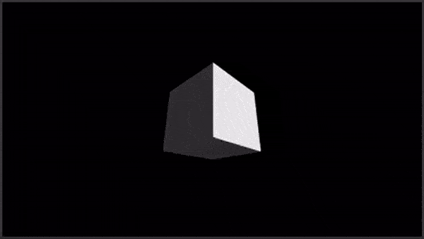

# Coordinates
<b>Coordinates</b> is a graphics API for JavaScript enabled web browsers. It has methods for leveraging the HTML5 canvas API to create <b>images</b>, <b>animations</b>, <b>games</b> or <b>artwork</b>. At this time, <b>WebGL</b> is the only supported context, but 2d canvas support is also planned. Note that Coordinates is under active development, and is in alpha stage, subject to architectural revisions that frequently break backward compatibility. It is recommended to fork the project or coordinates.js file at least, if you are building something so as to avoid function parameters changing, etc. <br>
<center>
  
 </center>
As a stand-alone module, <b>Coordinates</b> may be included in an HTML5 project, providing a framework for creating graphics <b>viewports, shaders</b>, stock and custom <b>shapes</b>, as well as <b>textures</b>, and a growing library of <b>effects</b>.


## Some example boilerplate
<b>Coordinates</b> uses functional design principles. There are no 'constructors'.<br>Most methods accept options via an object. E.g.
```js
var rendererOptions = {
  fov: 1500,  // field of vision
  ambientLight: .8,
  margin: 10,
  attachToBody: true  // if false, the canvas doesn't show up
}
```

Instantiation works with default settings as well. You can copy the code below  <br>
verbatim, into a file named ``index.html``, and see the result...<br>

```html
<!DOCTYPE html>
<html>
  <head>
    <title>Coordinates boilerplate example</title>
    <style>
      body, html{
        background: #333;
        margin: 0;
        min-height: 100vh;
      }
    </style>
  </head>
  <body>
    <script type="module">
    
      import * as Coordinates from
      "./coordinates.js"
    
      // instantiate a canvas. this is also our 'camera'
      var renderer = await Coordinates.Renderer()
      
      // back the camera away from the center (move it toward the viewer)
      renderer.z = 10
      
      // tell the API where to find our animation function
      Coordinates.AnimationLoop(renderer, 'Draw')

      // invoke a shader - phong in this case for a pseudo-lighting effect
      var shaderOptions = [ { uniform: { type: 'phong' } } ]
      var shader = await Coordinates.BasicShader(renderer, shaderOptions)


      // create a scene (it's async, so we can 'await' each call, but that is optional)
      var shapes = []
        // load a cube
      var geoOptions = { shapeType: 'cube', size: 5, color: 0x888888 }
      await Coordinates.LoadGeometry(renderer, geoOptions).then(async (geometry) => {
        shapes.push(geometry)
        await shader.ConnectGeometry(geometry)
      })  
      
      
      window.Draw = () => {
        shapes.forEach(shape => {
          shape.yaw   += .01
          shape.pitch += .005
          renderer.Draw(shape)
        })
      }
      
    </script>
  </body>
</html>
```
the result<br>

<br><br>

## methods, options, and their defaults
#### Renderer()
``Coordinates.Renderer( rendererOptions )``
##### returns a camera object, creates a canvas, async
```js
var rendererOptions = {
  alpha: false,
  width: 1920,  // the interior viewport dimensions (pixels)
  height: 1080,
  clearColor: 0x333333,  // grey
  fov: 2e3,  // "field of vision", the camera's focal length
             // useful range:
             //   500 (perspective) to 100,000 (orthographic)
  ambientLight: .5,
  x:    0, y:     0, z:   0,
  roll: 0, pitch: 0, yaw: 0,
  margin: 10,  // the viewport will expand to fill as much of the
               // visible page as possible, resizing automatically,
               // with a margin of this amount
  attachToBody: true, // this can be set to false, for
                      // background/buffer operations if needed
  context: {
    mode: 'webgl',    // 2d is semi-implemented,
                      // not working at this time
    options: {
      alpha:         true,
      antialias:     true,
      desynchronize: true,
    }
  }
}
```
<br>

#### AnimationLoop()
``Coordinates.AnimationLoop( renderer, 'Draw' )``<br>
##### Returns nothing. Takes no options
The function named should be a<br>
window global  ``window.Draw = () => { ... }``, as to be callable
<br><br>

#### BasicShader()
``Coordinates.BasicShader(renderer, shaderOptions)``<br>

##### Returns basic shader object, optional async
```js
var shaderOptions = {
  {
    uniform: { // phong shader
      enabled: true,   // may be toggled live, with other options
      type: 'phong',   // pseudo-lighting effect
      value: .3,       // intensity
      theta: .6,       // angle in radians about the horizontal
                       // (~4 oclock, default)
      flatShading: false,
    },
  },
  {
    uniform: { // reflection shader
      enabled: true,
      type: 'reflection', // reflect an image on shape surfaces.
                          // works best with 'equirectangular' maps
      map: 'https://example.com/image.jpg',
          // required. URL to an image or video (web formats accepted)
          // "power of 2" (64, 128, 256 etc.) width & height
          // makes it load directly, or it will be
          // resized in the background for drawing
          // performance, with a load-time hit
          // "po2" is required by *gl for texture wrapping
      value: .5,  // intensity. range: 0 = invisible, to 1 = total
      flatShading: false,
    },
  }
}
```
<br><br>

#### LoadGeometry()
``Coordinates.LoadGeometry( renderer, geoOptions )``<br>

##### Returns a mesh object, optional async
```js
var geoOptions = {
  name: 'background', // optional name for object
  x: 0, y: 0, z: 0,   // initial coordinates
  roll: 0,            // orientation / rotation
  pitch: 0,
  yaw: 0,
  scaleX: 1,          // resize (at creation)
  scaleY: 1,
  scaleZ: 1,
  color: 0x333333,    // optional color
  colorMix: .5,       // weight of the color, to mix with texture
  map: '',            // optional texture, URL to an image, or video.
                         // for videos, use ``muted: false`` to prompt
                         // the user to play audio, if desired.
  playbackSpeed: 1.0, // if the texture (map) is a video, adjust the speed (.1 to 10)
  sphereize: 1,       // interpolate a polyhedron to a sphere (=1), and beyond
                         // read more below about this feature
  averageNormals: false, // generate/recompute normals for any shape @ load
  size: 1,            // not required, but the default may not be appropriate.
  subs: 0,            // subdivides a polyhedron above, creating exponentially
                      // more polygons/faces. Advise no more than 4!
  equirectangular: false,  // if enabled, textures are assumed to be spherical
  shapeType: ''    // required.
                   // supported types:
                       • 'tetrahedron'
                       • 'cube'
                       • 'octahedron'
                       • 'dodecahedron'
                       • 'icosahedron'
                       • 'rectangle'
                         // is a squre, unless scaled
                       • 'sprite'
                         // supports alpha channel (png source)
                      // LIGHTS
                         //- other objects require phong shader for
                         //  lights to affect them, except for
                         //  ambient light
                       • 'point light'
                         // has optional properties:
                              'pointLightValue':   0.0 to 1.0...
                              'pointLightShowSource': true/false
                              // ignores shader, if one is connected
                       • 'cylinder'
                       • 'torus'
                       • 'torus knot'
                         // cylinder, torus [knot] accept 'rows' and 'cols', optionally. if omitted, high-res
                         // shapes are quick-loaded. recommend zero subs,
                         // omit rows/cols unless custom shape is needed.
                         // Or export a custom shape & load it as such.
                       • 'obj'
                       • 'custom shape',
                         // "custom shapes" may be obtained from any
                         // shape, by enabling the 'exportShape' option.
                         // These files may then be loaded via the
                         // shapeType 'custom shape', and 'url', which
                         // is streamlined for the fastest load times
  
  exportShape: false, // display popup for each geometry which has this option
  objX: 0,            // for 'OBJ' format models, initial offset
  objY: 0,
  objZ: 0,
  objRoll: 0,         // for 'OBJ' format models, orient/rotate
  objPitch: 0,
  objYaw: 0,
                      // enabled, to copy its raw data for later import as a
                      // 'custom shape'.
  flipNormals: false,    // invert normals
  showNormals: false,    // view normals on screen as red lines
  url: ''                // url for 'OBJ' format models, or 'custom shapes'.
                         // url is ignored otherwise.
}
```
<br><br>

#### geometry.sphereize = [value]
This value, when set as an option for LoadGeometry, interpolates a polyhedron
between its normal shape (e.g. a cube), and sphere. A value of 0 (zero) is the
shape's original, expected appearance, and 1 is a sphere. Values less than zero
or more than 1 are accepted. NOTE! if sphereize is used, you should set
``averageNormals: true``, to recompute the data used by reflections, lighting etc.
<br><br>

#### ConnectGeometry()
Performs linkage between geometry created with the ``LoadGeometry`` method, and a shader created with the ``BasicShader`` method. If not called, <b>Coordinates</b> will use a null shader (no effects) so the shape can be drawn. Connecting geometry to a shader removes it from any previous connections.

``shader.ConnectGeometry( geometry )``

##### Returns nothing, optional async
<br><br>

#### Clear()
Clears the viewport.<br>
Note: WebGL "swaps" buffers by default, resulting<br>
in the clearing of drawn elements, but not the background. This clears<br>
the background as well. See Renderer option 'clearColor', to set the color.<br>

``renderer.Clear()``

##### Returns nothing
<br><br>

#### Draw()
Draws a single geometry created with the ``LoadGeometry`` method<br>

``renderer.Draw( geometry)``

##### Returns nothing
